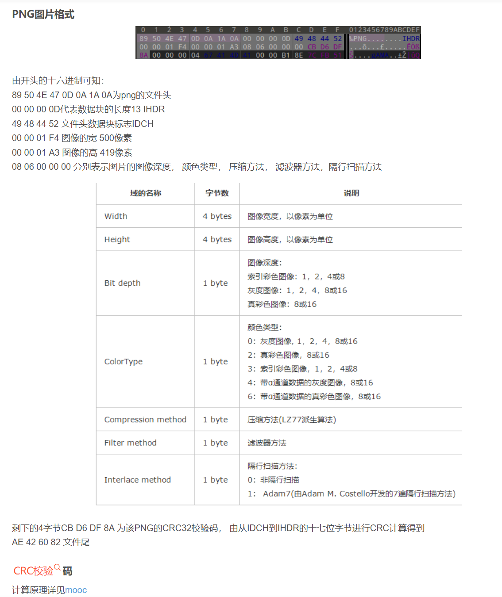
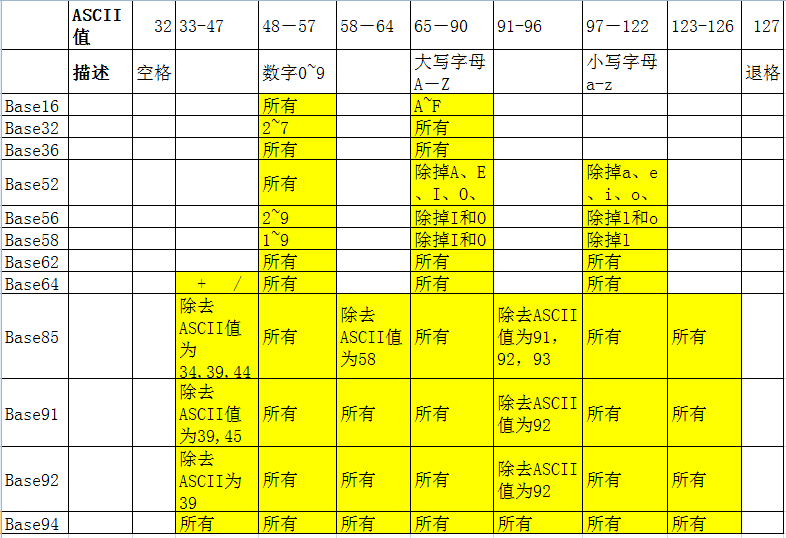

# 杂项

## 图片隐写

[【CTF】图片隐写术 &#183; 修复被修改尺寸的PNG图片 - 双份浓缩馥芮白 - 博客园](https://www.cnblogs.com/Flat-White/p/13515090.html)

+ [【CTF杂项】常见文件文件头文件尾格式总结及各类文件头_ctf常见文件头-CSDN博客](https://blog.csdn.net/xiangshangbashaonian/article/details/80156865)

+ 图片数据的点阵 (R, G, B)  *LSB最低有效位
  
  + [stegsolve图片隐写解析器的使用_stegsolve工具用法-CSDN博客](https://blog.csdn.net/weixin_43639682/article/details/113857310)
  
  + [CTF-Misc-LSB_ctflsb-CSDN博客](https://blog.csdn.net/qq_45163122/article/details/106139952)

+ GIF 帧 分解

+ EXIF

+ 

+ 图片png的参数（长，宽）
  
  + ps:包括jpg，只要详细信息长宽像素转化为十六进制然后winhex找到对应位置修改即可
  + 没有详细信息：CRC暴力破解相关
    + 例题[KCTF_MISC:神秘的图片_ctf 神秘的图片-CSDN博客](https://blog.csdn.net/qq_45149832/article/details/126851313)

+ 图片的倒序存储
  
  + 见reversepng.py

+ 文件追加

+ python中PIL模块的利用基础
  
  + （1）通道
  
  + （2）模式
  
  + （3）图像尺寸
  
  + （4）图像格式
  
  + （5）IMAGE的方法

+ binwalk
  
  + 分析 binwalk /home/file/(filename)
  
  + （本机使用方法：binwalk --run-as=root -e /home/file/(filename)）
  
  + 分离 foremost -o /home/output -i /home/file/(filename)

## 音频

**（工具：audacity）**

[CTFmisc常见音频隐写总结_ctf 音频隐写-CSDN博客](https://blog.csdn.net/qq_51652400/article/details/123504708)

+ 波形与频谱

+ 音频中的编码

## ZIP文件

+ [CTF——zip伪加密-CSDN博客](https://blog.csdn.net/xiaozhaidada/article/details/124538768)

+ 压缩包密码
  
  + 暴力攻击
  
  + 字典攻击
  
  + 掩码攻击

+ python zipfile模块

## 编码

